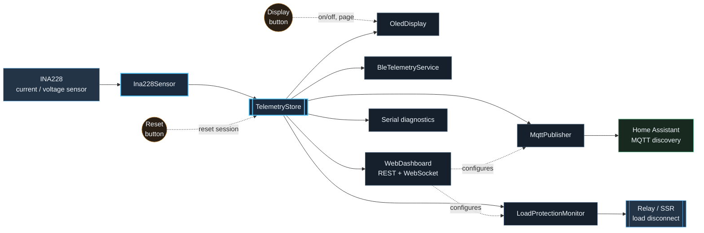

# Battery Current Monitor — Revision A

Modular firmware for a wireless battery current monitor using a Seeed Studio
XIAO ESP32-C3, INA228 and SSD1309 128x64 OLED.

## Companion app and shared contract

This firmware pairs with the public [Battery Monitor Flutter
app](https://github.com/duceppemo/battery-monitor-app). The projects are
separate repositories but one product: protocol or OTA changes must be made
and released compatibly in both. The canonical packet and control contract is
[docs/BLE_PROTOCOL.md](docs/BLE_PROTOCOL.md); the matching app copy exists so
mobile development remains self-contained. Binary Telemetry v1 is a fixed
20-byte, one-Hz notification and must remain compatible without MTU
negotiation. The app discovers public GitHub Releases without embedded
credentials, downloads the OTA `.bin` before connecting, and transfers it over
BLE only after reading the monitor firmware version.

## Current architecture

`src/main.cpp` is intentionally tiny; `BatteryMonitorApp` owns this wiring and
polls every subsystem from one loop. Dashed arrows are configuration paths
(a physical button, or a setting saved from the Web Dashboard); solid arrows
are the telemetry flow. See [docs/ARCHITECTURE.md](docs/ARCHITECTURE.md) for
the full component breakdown, including the Settings/Monitor pattern each
consumer here follows.

### OLED display

The two pages the physical button cycles between (recreated here for
documentation — not a photo of the actual display):

### Web Dashboard

## Implemented features

- Direct INA228 register reads over I2C, explicit conversion configuration
  with boot-time readback verification, versioned NVS calibration profile
- Voltage, current, power, die temperature and shunt-voltage telemetry,
  timestamped and self-contained with complete/incomplete sample health
  counters
- Session Ah/Wh accounting, plus a persisted, coulomb-counted state-of-charge
  fuel gauge with auto/manual full-charge resync and deepest-discharge/
  cycle-count/average-depth history
- Min/max tracking, persistent low/high-voltage/current/temperature/
  sensor-health alarms
- SSD1309 OLED; BLE characteristics with human-readable descriptors,
  acknowledged controls and combined telemetry
- Concurrent Wi-Fi recovery SoftAP, optional home-network station mode, live
  Web Dashboard with a push WebSocket and REST API
- MQTT publishing with Home Assistant MQTT Discovery (Web Dashboard only)
- Optional low-voltage/low-SoC load-protection relay output, disabled by
  default until explicitly configured, with manual reconnect and bench-test
  connect/disconnect controls, from either the Web Dashboard or BLE app
- Local Web Dashboard and BLE firmware transfer (CRC-32 + image
  verification, shared OTA writer lock), physical session-reset and
  OLED-power pushbuttons

See [docs/ROADMAP.md](docs/ROADMAP.md) for what's planned next and the
acceptance criteria behind each feature above.

## Documentation

- [docs/ARCHITECTURE.md](docs/ARCHITECTURE.md) — design rules, runtime flow
  and component responsibilities
- [docs/BLE_PROTOCOL.md](docs/BLE_PROTOCOL.md) — the firmware/app BLE
  contract: telemetry, dashboard pages, control commands
- [docs/HARDWARE.md](docs/HARDWARE.md) — wiring, the load-protection relay
  driver circuit, calibration and flash partition layout
- [docs/WEB_DASHBOARD.md](docs/WEB_DASHBOARD.md) — Wi-Fi setup, dashboard
  overview, MQTT/Home Assistant and load protection usage
- [docs/BUILD.md](docs/BUILD.md) — build environment and Arduino-ESP32/BLE
  library compatibility notes
- [docs/RELEASES.md](docs/RELEASES.md) — release asset, install paths and
  the publishing checklist
- [docs/SHUNT_COMMISSIONING.md](docs/SHUNT_COMMISSIONING.md) — moving from
  the prototype shunt to the final Kelvin shunt
- [docs/ROADMAP.md](docs/ROADMAP.md) — implementation order, design
  decisions and acceptance criteria
