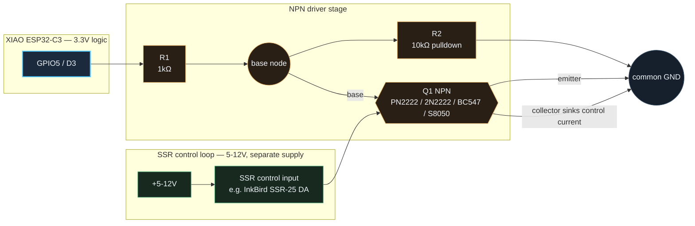

# Hardware

## I2C

| XIAO ESP32-C3 | Function |
|---|---|
| GPIO6 / D4 | SDA |
| GPIO7 / D5 | SCL |
| 3V3 | INA228 VS + OLED VDD |
| GND | INA228 GND + OLED GND |

Current prototype addresses:

- INA228: `0x40`
- SSD1309: `0x3C`

## Pushbuttons

Both buttons use `INPUT_PULLUP`, so no external pull-up resistor is required.
Use normally-open momentary buttons.

```text
GPIO3 ---- pushbutton ---- GND    Session reset / ESP32 restart
GPIO4 ---- pushbutton ---- GND    OLED page / power
```

Briefly press the reset button to reset all session values (min/max + Ah/Wh).
Hold it for one second to restart the ESP32; a long press does not also reset
the session values first.

Briefly press the display button to switch between the live/session and
min/max pages. Hold it for one second to call the SSD1309/U8g2 power-save
function instead.
Measurement, BLE and Wi-Fi continue operating while the OLED is off.

## Load-protection relay (optional)

`GPIO5` (XIAO `D3`) drives the load-protection relay/SSR, HIGH for load
connected and LOW for disconnected. A bare 3.3 V GPIO is at the low end of a
typical SSR's 3-32 V DC control range, so drive it through an NPN/MOSFET
stage rather than wiring the GPIO straight to the SSR's control input — a
PN2222 (or 2N2222/BC547/S8050) with a 1 kΩ base resistor from the GPIO and a
10 kΩ base pulldown works well; the pulldown also keeps the relay open if the
pin floats during the brief window before `pinMode()` runs at boot. Use a
separate 5-12 V supply for the SSR's control side — it does not need to be
3.3 V. This output only does anything once load protection is explicitly
enabled from the Web Dashboard or BLE app; see
[WEB_DASHBOARD.md](WEB_DASHBOARD.md#load-protection-optional).

### Driver stage diagram



This is a topology sketch (connection order, not a drawn schematic with real
component footprints); a full hardware BOM and physical wiring diagram
covering every subsystem is planned as a follow-up.

Pins are centralized in `include/AppConfig.h` and can be changed there.

## Measurement configuration and calibration

At boot, firmware explicitly configures the INA228 for continuous bus, shunt
and temperature conversion, 16-sample averaging, 1.052 ms conversion time and
the wide +/-163.84 mV shunt range. The register values are read back and shown
in the dashboard's Sensor details panel and `/api/telemetry` response.

The first-boot calibration default is the INA228 breakout's onboard `R015`
shunt:

```cpp
constexpr float SHUNT_RESISTANCE_OHMS = 0.015f;
```

The calibration module is deliberately separate from measurement acquisition.
It validates and stores shunt resistance, shunt-voltage offset and current gain
in NVS; invalid or absent settings safely use the compile-time default. The
dashboard's Guided calibration card captures zero-current and reference samples,
calculates the gain, and then requires an explicit save. Saving or restoring a
profile starts a new min/max and Ah/Wh session.

For the planned 100 A / 50 mV Kelvin shunt, the nominal resistance will be:

```cpp
0.050f / 100.0f == 0.0005f
```

See [SHUNT_COMMISSIONING.md](SHUNT_COMMISSIONING.md) before moving to the new
shunt.

## Flash partition layout

The project uses the Arduino-ESP32 `min_spiffs.csv` 4 MB partition scheme.
This provides two larger OTA-capable application slots (about 1.9 MB each),
which is required because Wi-Fi + BLE + the web dashboard exceed the XIAO
ESP32-C3 default 1.25 MB OTA application slot. It provides the inactive
application slot used by the Web Dashboard and BLE firmware-update paths.

If changing partition schemes on a board that already has firmware installed,
perform a full flash erase once before uploading the new build if the board
does not boot after the first upload.
